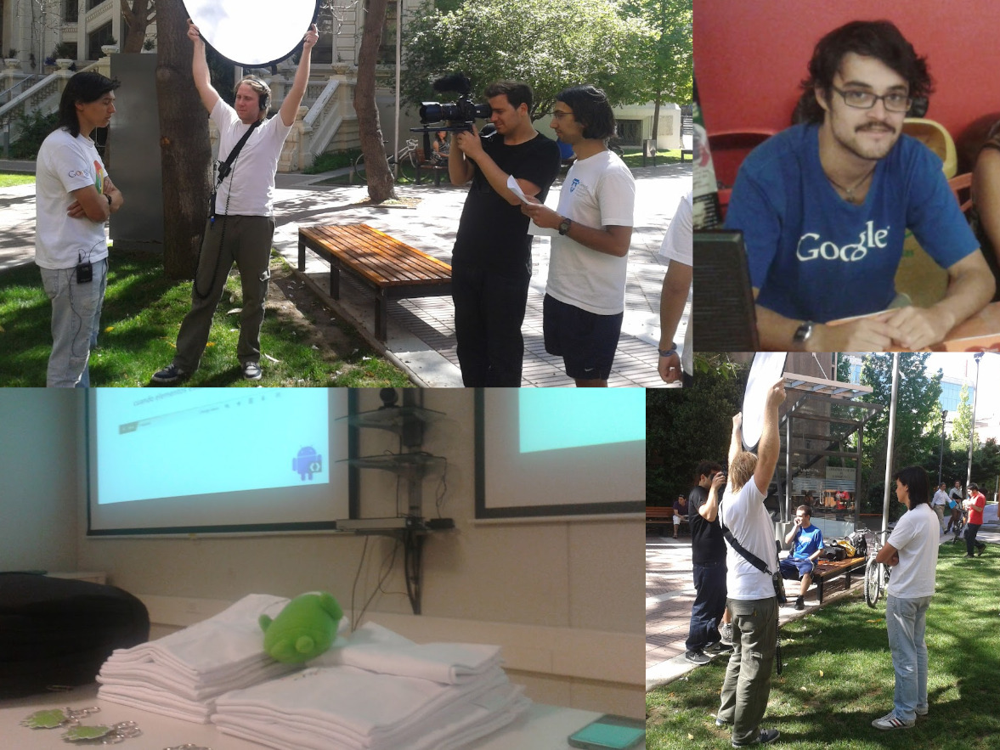

Title: Cómo dejé de usar Google - Parte 1
Date: 2023-08-12 20:42
Modified: 2023-08-24 16:12
Category: Test
Tags: testing, blogging, nogafam
Slug: good-bye-google
Author: Creps
Summary: En esta serie de post les voy a ir contando las medidas que voy generando para abandonar de una vez por todas la cantidad ridícula de aplicaciones con las que google monetiza nuestros datos.
Status: published

Hola. Quería hacer un post sobre otra cosa. Resulta que ~~esta~~ la anterior semana se celebraron los 30 años de la creación del proyecto  Debian. Nacimos casi al mismo tiempo. Nunca he usado una distribución Debian "limpia". Siempre alguna basada en otra. Tampoco he usado tantas, recuerdo partir con Linux Mint, que está basada en Ubuntu que está basado en Debian. Durante un tiempo usé Fedora, cuando le decían Freidora xD. También usé Elementary OS cuando era hipster y quería ser un chico MAC. Ahora uso Ubuntu, hace mucho tiempo me quedé pegado en esta distro. En fin. En algún momento probaré Debian a secas y prometo hacer un post de como me salga.

La cuestión es que actualmente me he estado metiendo aun más profundamente en el mundo del open source. En el Fediverso, como le llaman. El mismo amigo que por allá por el 2008-2009 me introdujo en el mundo del software libre, sigue invitandome a participar de espacios hackers. Yo respondo feliz que si. Así, por ejemplo, conocí [Ética Digital](https://eticadigital.cl) o [Sursiendo](https://sursiendo.org/). También he llegado a grupos de personas con ideas parecidas a las mías. Alguna vez di con [Komun](https://komun.org/), con [FACTTIC](https://facttic.org.ar/) y más recientemente con [ENVS](https://envs.net). Les invito a revisar esos sitios, tienen servicios bien útiles, como un acortador de urls, documentos colaborativos en línea y demáses.

Esta búsqueda viene un poco acompañada por volver a darle sentido a la carrera que elegí estudiar. En la que he invertido largos 10 años de mi vida  y de la que he querido huir en varias ocasiones. Afortunadamente, pillarme de nuevo con este mundillo me ha re encantado. 

Resulta que fui un Google Fan. Pero así hasta las patas. Tipo llegué a Gmail cuando se necesitaba una invitación de alguien que tuviera una cuenta para poder entrar al 'club'. Luego tenías 10 invitaciones para regalar, super exclusive. He probado cada verga que se le ha ocurrido hacer al gugul. Cada red social fallida, ahí estaba yo, el beta tester moviendo la vaina. Gugel Buzz me gustaba, wave era asquerosamente lenta y para que hablar de goegel plaassss. Mejor recordar el bonito Picasa, que lo usaba antes que el gran fagocitador de aplicaciones tecnológicas hiciera lo suyo.

No solo era fanático de las aplicaciones, también de la empresa. Charla que iban a hacer a la universidad, charla en la que participaba. Hacía fila para recibir la nueva versión de una polera o un llavero y orgulloso la usaba declarando que era una empresa en la que en algún futuro trabajaría. Una vez, estaban buscando gente para hacerle una entrevista y hablar de las aplicaciones de que más usabas. Ahí estaba yo, fiel fanático desinteresado... Y como dice el dicho, fotos o no pasó, les dejo algunas para que me crean. Ahí aparece día de la grabación, las charlas a las que iba y de una polera que no dejaba de usar pero jamás nunca...

Y bueno, llegué a un punto en mi vida en que pasé del amor al odio. Empecé a interesarme en la política, en como funciona el mundo, en las grandes empresas y su influencia. Me pegué el alcachofaso como se dice en shileno. Y como ya he apostatado anteriormente, no me cuesta tanto pasar por ese proceso. La cosa es que no basta solo con pensarlo, hay que pasar a la acción. Y hace ya harto tiempo que anda rondando en mi cabeza una idea: usar menos aplicaciones de grandes empresas multinacionales que se creen dueñas del internet. Y si no me creen a lo que me refiero, investiguen acerca de la propuesta llamada Web Enviroment Integrity. [Aqui más info en inglish.](https://www.defectivebydesign.org/blog/web_environment_integrity_is_an_all_out_attack_on_free_internet).

Hay un gran obstaculo para lograr este acometido. Y es que la gran G se ha metido en todas partes. De solo pensar en todo lo que un teléfono tiene con las narices de gogel en medio da una flojera tremenda. Precisamente somos nosotrxs mismxs ese gran obstaculo. Así que trataré de empezar por lo facil. Crearse una cuenta de correo en algún otro servicio. Estos son los que me han recomendado:

* [Protonmail](https://proton.me/mail). Si quieres una transicción lenta y comoda, esta es tu opción. Leí de su existencia en algún fanzin o blog hace un par de años y desde que la uso ha cambiado bastante. Por ahí supe de una noticia que habían entregado alguna dirección IP cuando la Interpol le pidió a Suiza, donde están los servidores de Proton, que los obligaran a pasarles la info. Así que "no tuvieron nada más que hacer" que seguir las leyes. De ahí que perdió un poco de popularidad en el mundillo, pero ganó otra y empezó a crecer bastante. Tanto así que ahora tiene ProtonDrive. A pesar de todo, sigo creyendo que es un buen punto de partida.
* [Tutanota](https://tutanota.com/es/). Este servicio no lo había probado antes, pero me lo habían recomendado. Al momento de escribir este articulo me estoy creando una cuenta para ir probando alternativas.
* [Austistici](https://www.autistici.org/). Este es el que más confianza me da en cuanto a la privacidad. No sé bien porqué. Es una cuestión intuitiva, de la imagen que proyectan y por la persona me lo recomendó y el uso que le daba. 

Una vez con la cuenta de correo, hay que empezar a separar las cosas. Para eso me ha servido manter la división entre herramientas libres y privativas. Evitar poner el nuevo correo en cada página que te pida una suscripción, para mantenerlo libre de spam y así alivianar la carga de los servidores donde se aloja. Utilizarlo para hacerte cuentas en plataformas o redes sociales libres, hay un montón y toda una comunidad super interesante y entretenida detrás. Crea también niveles, el correo de proton lo usaré para cuestiones que tengan poca relevancia y el de tutanota para los que quiera guardar con más recelo y así. 

Es un largo camino por recorrer y espero irles contando como me va yendo. Me ayuda también a motivarme por avanzar en la idea y para darle contenido al blogsito, no dejarlo tan abandonado. Sl2.